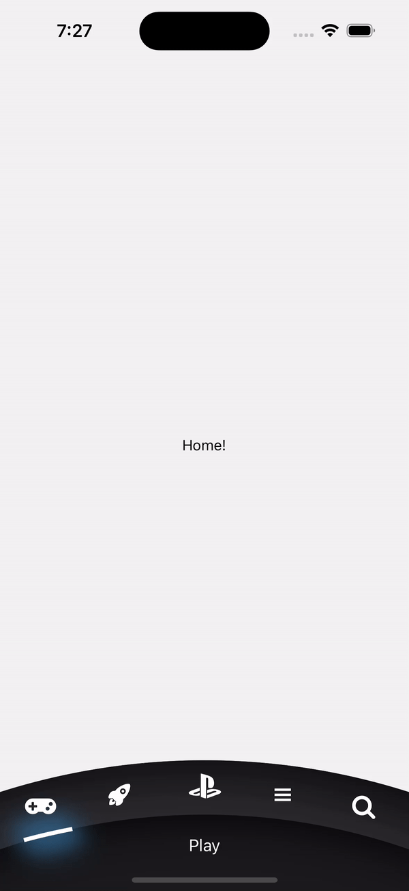
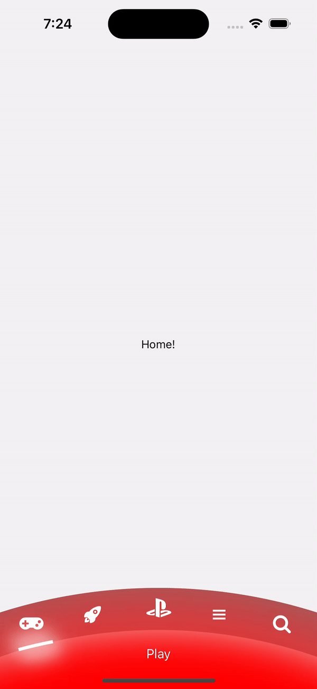

# React Native PS Bottom Tab Bar

A custom bottom tab bar component for React Native.

## Installation

Install the package using npm:

```shell
npm install react-native-ps-bottom-tabbar
```

or with Yarn:

```shell
yarn add react-native-ps-bottom-tabbar
```

## Usage

Import the `PSBottomTabBar` component from the package:

```jsx
import { PSBottomTabBar } from 'react-native-ps-bottom-tabbar';

const MyComponent = () => {
  // Your code here
};
```

Use the PSBottomTabBar component in your code to display the custom bottom tab bar:

```jsx
<PSBottomTabBar
  state={state}
  navigation={navigation}
  descriptors={descriptors}
  selectorStyle={{ backgroundColor: '#fff', shadowColor: '#305F84' }}
  topAreaStyle={{
    backgroundColor: '#1E1F23',
    shadowColor: '#000',
    shadowRate: 2,
  }}
  bottomAreaStyle={{
    backgroundColor: '#1B1C1E',
    shadowColor: '#000',
    shadowRate: 2,
  }}
/>
```

## Props

The `PSBottomTabBar` component accepts the following props:

- `state` (required): A state object containing the navigation state.
- `navigation` (required): The navigation object.
- `descriptors` (required): An object containing descriptors for the routes.
- `selectorStyle` (optional): An object that defines the style of the selector. It has the following properties:
  - `backgroundColor` (optional): The background color of the selector. Defaults to `'#fff'`.
  - `shadowColor` (optional): The shadow color of the selector. Defaults to `'#305F84'`.
- `topAreaStyle` (optional): An object that defines the style of the top area. It has the following properties:
  - `backgroundColor` (optional): The background color of the top area. Defaults to `'#1E1F23'`.
  - `shadowColor` (optional): The shadow color of the top area. Defaults to `'#000'`.
  - `shadowRate` (optional): The shadow rate of the top area. Defaults to `2`.
- `bottomAreaStyle` (optional): An object that defines the style of the bottom area. It has the following properties:
  - `backgroundColor` (optional): The background color of the bottom area. Defaults to `'#1B1C1E'`.
  - `shadowColor` (optional): The shadow color of the bottom area. Defaults to `'#000'`.
  - `shadowRate` (optional): The shadow rate of the bottom area. Defaults to `2`.

## Example usage:

```jsx
import { PSBottomTabBar } from 'react-native-ps-bottom-tabbar';

const Tab = createBottomTabNavigator();

export enum Routes {
  Play = 'Play',
  Discover = 'Discover',
  Playstation = 'Playstation',
  Library = 'Library',
  Search = 'Search'
}

const TABS = {
  [Routes.Play]: { icon: <FontAwesome5 name='gamepad' size={24} color='white' />, label: Routes.Play },
  [Routes.Discover]: { icon: <Ionicons name='rocket' size={24} color='white' />, label: Routes.Discover },
  [Routes.Playstation]: { icon: <Fontisto name='playstation' size={24} color='white' />, label: Routes.Playstation },
  [Routes.Library]: { icon: <Ionicons name='menu' size={24} color='white' />, label: Routes.Library },
  [Routes.Search]: { icon: <FontAwesome name='search' size={24} color='white' />, label: Routes.Search },
};

export const Navigation = () => {
  return (
    <SafeAreaProvider>
      <NavigationContainer>
        <StatusBar style='auto' />
        <Tab.Navigator
          tabBar={props =>
            <PSBottomTabBar{...props} />
          }
          screenOptions={({ route: { name } }) => ({
            headerShown: false,
            tabBarIcon: TABS[name].icon,
          })}
        >
          <Tab.Screen name={Routes.Play} component={HomeScreen} />
          <Tab.Screen name={Routes.Discover} component={DiscoverScreen} />
          <Tab.Screen name={Routes.Playstation} component={PSScreen} />
          <Tab.Screen name={Routes.Library} component={LibraryScreen} />
          <Tab.Screen name={Routes.Search} component={SearchScreen} />
        </Tab.Navigator>
      </NavigationContainer>
    </SafeAreaProvider>
  );
};

// ...
```

Make sure to provide the required props (state, navigation, and descriptors) and customize the appearance of the tab bar by adjusting the optional props (selectorStyle, topAreaStyle, and bottomAreaStyle).

Feel free to customize the appearance of the `PSBottomTabBar` component by adjusting the following props
